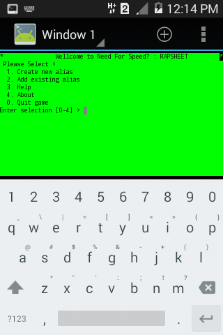

# Rapsh GAME (DEMO) 

## Sinopsis

Rapsh means rapsh(eet) imitated from the mini game in the famous Game, namely Need For Speed ​​belonging to EA games.

### What is Rapsheet?

The Rap Sheet is a record of registered crimes by the Rockport Police Department in Need for Speed: Most Wanted. It summarises all crimes committed by Blacklist racers.

The Rap Sheet shows the player's name, total bounty, cost to state, fines due, confiscated and monitored vehicles, as well as their evaded and busted pursuits.

It is introduced to the player by Mia Townsend after defeating Blacklist racer #14 Taz.
Quoted by https://nfs.fandom.com/wiki/Rap_Sheet

## Early access
This game is still early to be played, My lack of ability in terms of making this game alive. But you can enjoy the animation which still looks like a game even though

### Instalation
Install di termux

> pkg install git

> pkg install mksh

> cd ~

> git clone https://github.com/luisadha/rapsh.git

> cd rapsh

> mksh rapsh.sh

## Contributor
Contrib this repo are welcome.

E-mail: adharudin14@gmail.com

## License

